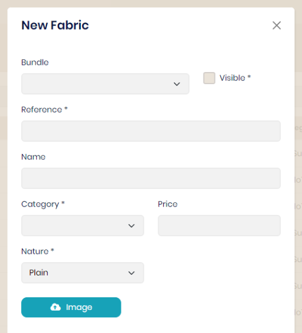

## Materials

A set of materials is necessary for product design: fabric, lining, button, felt, elbow patch, satin, badge, stitch.

Example configuration for fabrics :

<table>
    <tbody>
        <tr class="border-0">
            <td align="left" width="450" class="border-0">
                
            </td>
            <td class="border-0"></td>
            <td width="350" class="border-0">
                A bundle can be defined but not obligatory. This allows you to refine searches.  
                 The 'visible' property allows you to hide an element during queries without deleting it. Example: A fabric is being integrated but should not be visible.  
                 Enter the reference, unique identifier and its name which is a complement for the display.  
                 The nature of the fabric and the category can also refine the selection.  
                 The price indicated is first level. It can be redefined when selecting fabrics by model.  
                 The chosen image must be in JPG format. It will be saved with a height of 500 pixels and a thumbnail of 35 pixels.
            </td>
        </tr>
    </tbody>
</table>
