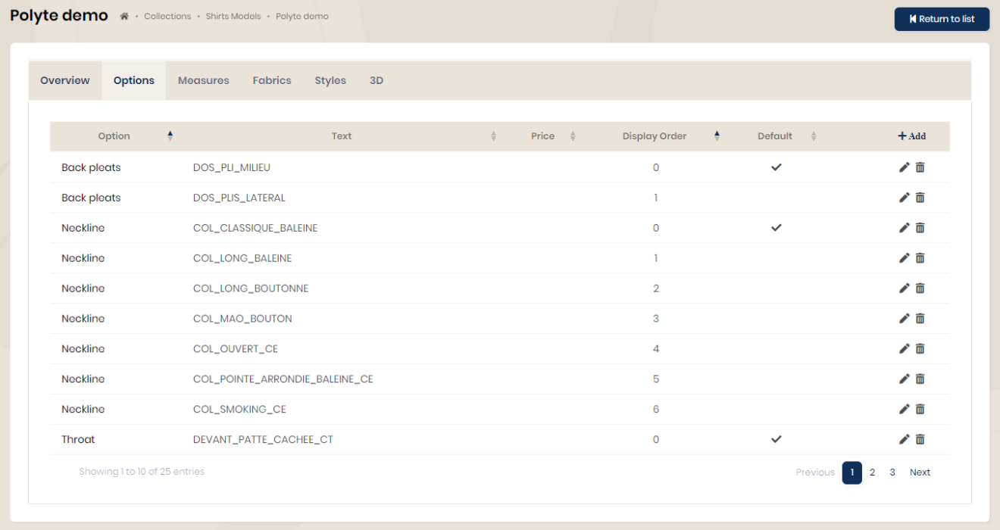
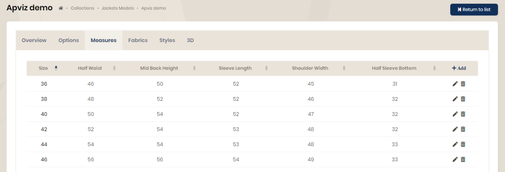
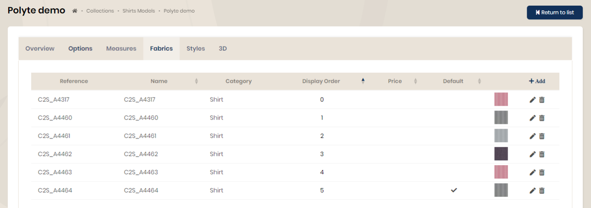

## Models

Each type of product (jacket, polo shirt, etc.) must have models in order to be configurable.

The creation of models is done from the “Collections” menu then the choice of product type.

<table>
    <tbody>
        <tr class="border-0">
            <td align="left" width="450" class="border-0">
                
            </td >
            <td class="border-0"></td>
            <td width="350" class="border-0">
                The 'visible' property allows you to hide an element during queries without deleting it. Example: A model is being integrated but should not be visible.  
                Choose a main style, category and genre according to the preliminary definition.  
                The 'product type' field is an additional field to refine the filters during searches. A value will be entered or not depending on the needs.  
                The display order allows you to assign a sort order when requesting the list of models.  
                An image can be assigned to each model and will not be resized. It is best to adjust the weight first.  
                The 3D tab will only be useful when using this technology.
            </td>
        </tr>
    </tbody>
</table>

### Options

Each model has the possibility to configure options. The option list is pre-defined because it is directly linked to the on-demand production system.

A price, a display order during queries and a default value can be defined.

### Measures

A table of measurements exists for each model. Measurements recorded vary depending on product type.

### Fabrics

For each model, it is possible to link a list of fabrics in order to display a selection when ordering. This is useful when not all fabrics in a category are available for a particular model.

A price, a display order during queries and a default value can be defined.

