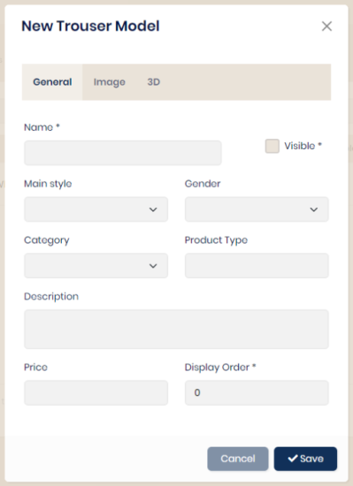

## Models

Each type of product (jacket, polo shirt, etc.) must have models in order to be configurable.

The creation of models is done from the “Collections” menu then the choice of product type.

<table>
    <tbody>
        <tr>
            <td align="left" width="450">
                
            </td>
            <td align="center"></td>
            <td width="350">
                The 'visible' property allows you to hide an element during queries without deleting it. Example: A model is being integrated but should not be visible.  
                Choose a main style, category and genre according to the preliminary definition.  
                The 'product type' field is an additional field to refine the filters during searches. A value will be entered or not depending on the needs.  
                The display order allows you to assign a sort order when requesting the list of models.  
                An image can be assigned to each model and will not be resized. It is best to adjust the weight first.  
                The 3D tab will only be useful when using this technology.
            </td>
        </tr>
    </tbody>
</table>

### Les options

### Les mesures

### Les tissus
