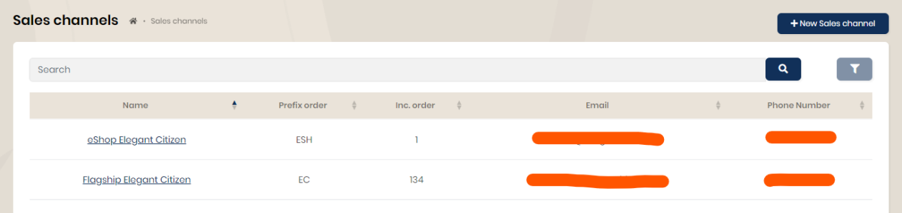
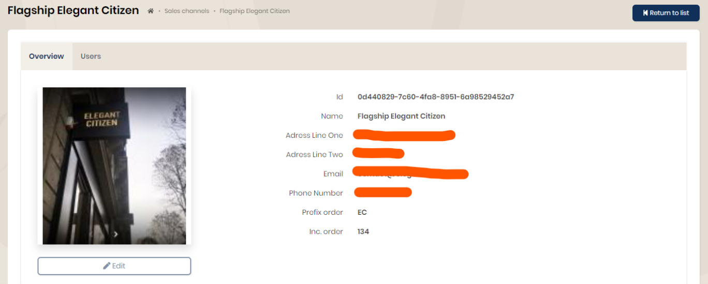

## Sales channels

A sales channel is a physical (store) or virtual (e-commerce site) point. Any user created will only be able to access the information (orders, customers, etc.) of the sales channel to which they are linked.

Before any use, you must create one or more points of sale in order to be able to link user accounts to them.

From the "Sales channels" menu, use the "+New sales channel" button. Complete the form and validate. Once created, it is displayed in the list. By clicking, you get the details.

