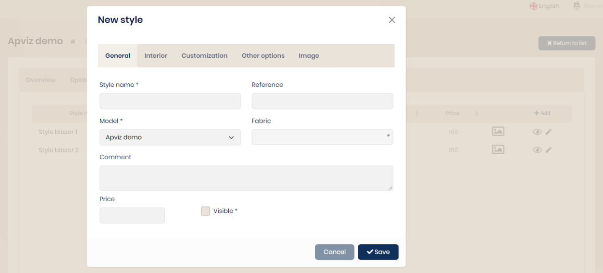

## Styles

Styles are created from the dedicated tab of the model chosen from the 'Add' button.

When entering, you must enter each option and material necessary when requesting production. An image can be added.

