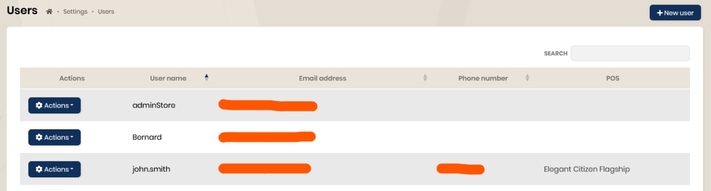

## Users

### Accounts and roles

Three types of accounts or `rôles` are available :
 - adminStore : administrator account reserved for BackOffice
 - store : user account linked to a sales channel
 - factory : account dedicated to production view

An adminStore account is provided when creating the tenant with the TenantId. This account has the role 'adminStore'.

To create a user account, you must go to the “Settings” menu then “Users.

