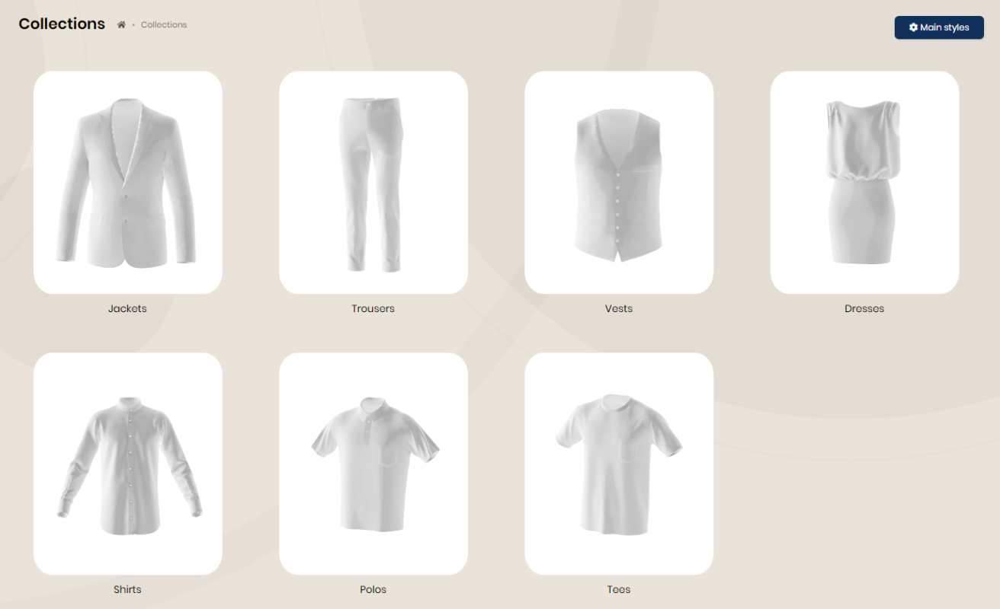
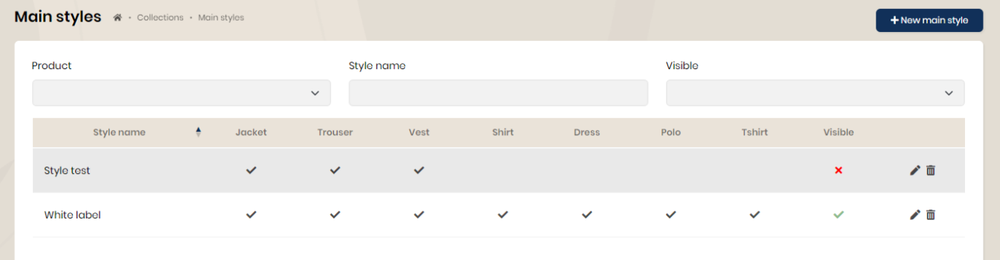
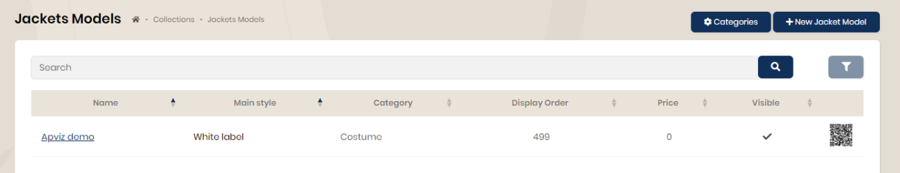
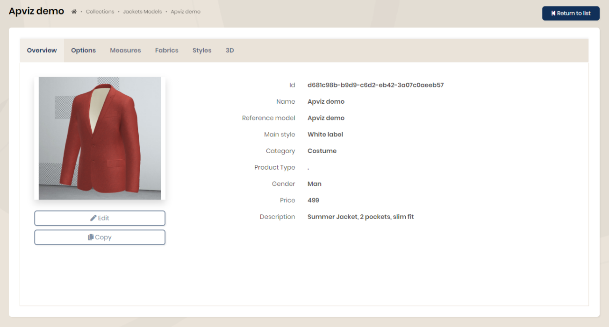

## Collections

The collections detail all the characteristics of the products available on the platform, whether tailor-made or ready to wear.

### Main styles

It is possible to define "main styles" grouping one or more types of products.

In the example below, the main style 'White label' will be able to integrate all product types. It will be necessary to specify when entering the models, whether they belong to the chosen collection.

### Products

All the information discussed below will be identical for each type of product (jacket, pants, shirt, etc.).

When choosing jackets, the list of models is displayed.

#### Categories

From this page, it is possible to define jacket subcategories (suit jacket, leather jacket, jerkin, etc.). This will allow filters to be applied when displaying product listings.

#### Models

When choosing the model, you access all its information (preview, options, measurements, styles, fabrics and 3D).

