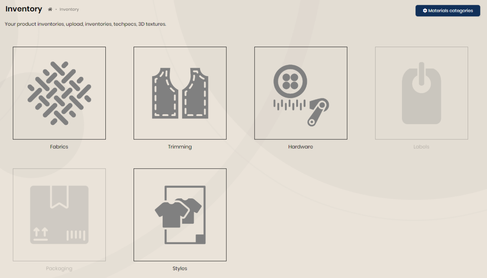
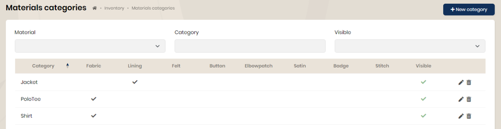
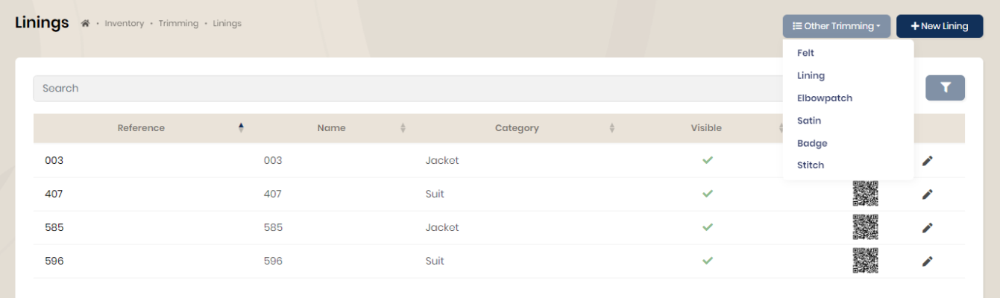
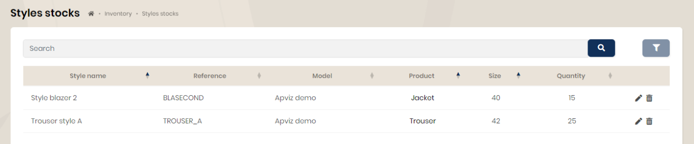

## Inventory

Thumbnails allowing access to available client applications are added at the end of the page.

### Materials categories

It is possible to define “material categories” grouping one or more types of materials.

In the example below, the 'Shirt' category can include fabrics. When entering fabrics, you can define the corresponding category.

### Materials

The 3 tiles 'fabrics, trimming and hardware' provide access to the lists of materials and their information.

### Styles

The 'Styles' tile provides access to the stock of pre-defined styles in the models.

