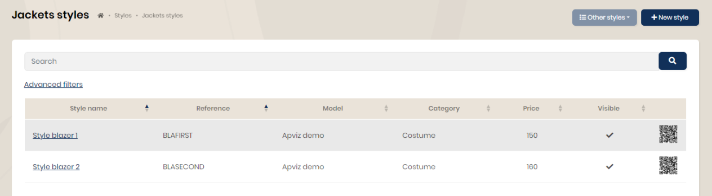
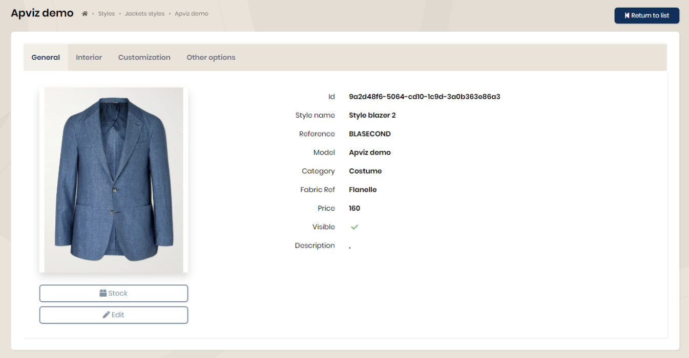

## Styles

Styles are pre-configured models (options, measurements, fabrics). They are intended to be ordered for ready-to-wear. They are available for all product types.

By choosing a style, you access the sheet which details the pre-configured options and materials. The measurements are those of the base model.

