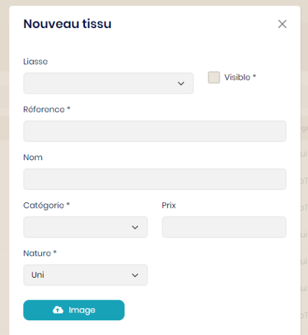

## Matières

Un ensemble de matères est nécessaire pour la conception des produits : tissu, doublure, bouton, feutre, coudière, satin, écusson, couture.

Exemple de configuration pour les tissus :

<table>
    <tbody>
        <tr class="border-0">
            <td align="left" width="450" class="border-0">
                
            </td>
            <td class="border-0"></td>
            <td width="350" class="border-0">
                Une liasse peut être définie mais non obligatoire. Cela permet d’affiner les recherches.  
                La propriété 'visible' permet de cacher un élément lors des requêtes sans le supprimer. Exemple : Un tissu est en cours d’intégration mais ne doit pas être visible.  
                Saisir la référence, identifiant unique et son nom qui est un complément pour l’affichage.  
                La nature du tissu et la catégorie pourront également affiner la sélection.  
                Le prix renseigné est de premier niveau. Il peut être redéfini lors de la sélection de tissus par modèle.  
                L’image choisie devra être au format JPG. Elle sera sauvegardée avec une hauteur de 500 pixels et une miniature de 35 pixels.
            </td>
        </tr>
    </tbody>
</table>
