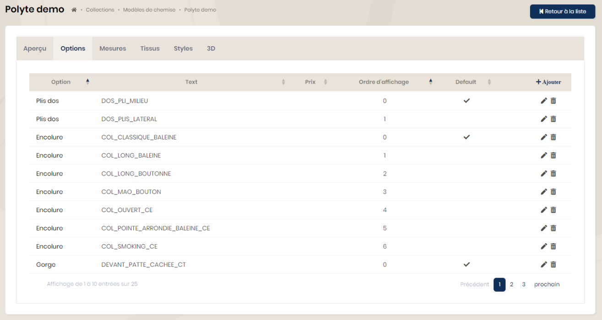
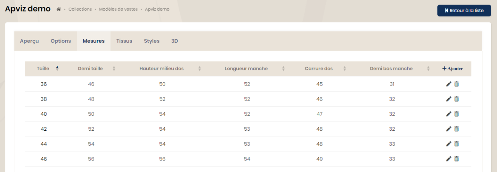
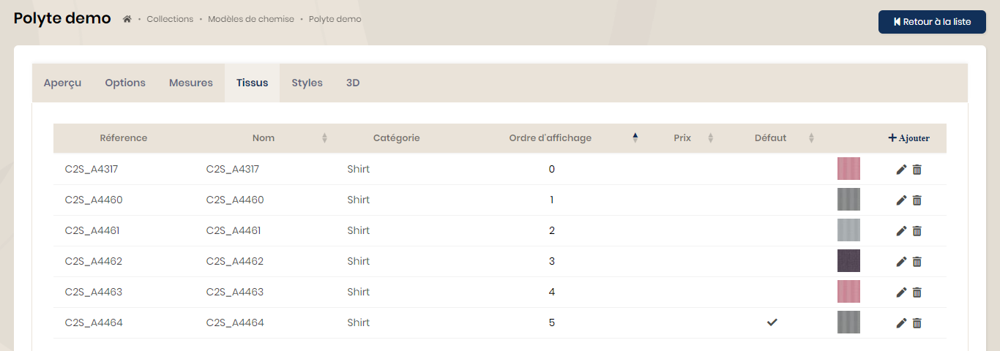

## Modèles

Chaque type de produit (veste, polo, …) doit avoir des modèles afin d’être configurable.

La création des modèles se fait depuis le menu "Collections" puis le choix du type de produit.

<table>
    <tbody>
        <tr class="border-0">
            <td align="left" width="450" class="border-0">
                
            </td>
            <td class="border-0"></td>
            <td width="350" class="border-0">
                La propriété 'visible'permet de cacher un élément lors des requêtes sans le supprimer. Exemple : Un modèle est en cours d’intégration mais ne doit pas être visible.  
                Choisir un style principal, une catégorie et le genre selon la définition préalable.  
                Le champ 'type de produit' est un champ supplémentaire afin d'affiner les filtres lors de recherches. Une valeur sera ou pas saisie selon les besoins.  
                L’ordre d’affichage permet d’affecter un ordre de tri lors de la demande de la liste des modèles.  
                Une image pourra être attribuée à chaque modèle et ne sera pas redimensionnée. Il est préférable d’ajuster le poids avant.  
                L'onglet 3D ne sera utile qu'en cas d'utilisation de cette technologie.
            </td>
        </tr>
    </tbody>
</table>

### Les options

Chaque modèle dispose de la possibilité de configurer des options. La liste d'option est pré-définie car elle est en lien direct avec le système de production à la demande.

Un prix, un ordre d'affichage lors des requêtes et une valeur par défaut peuvent être définis.

### Les mesures

Une table des mesures existe pour chaque modèle. Les mesures enregistrées varient selon le type de produit.

### Les tissus

Pour chaque modèle, il est possible de lier une liste de tissus afin d'afficher une sélection lors de la prise de commande. Cela est utile lorsque tous les tissus d'une catégorie ne sont pas disponibles pour un modèle particulier.

Un prix, un ordre d'affichage lors des requêtes et une valeur par défaut peuvent être définis.

