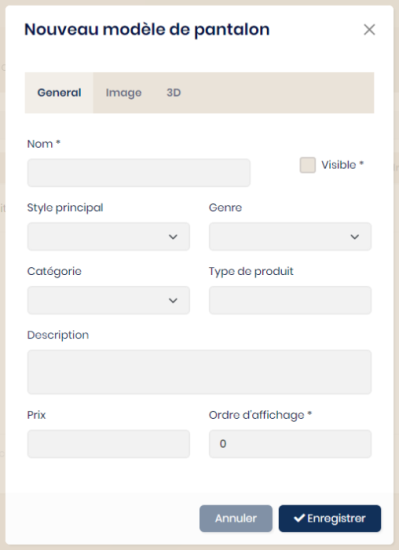

## Modèles

Chaque type de produit (veste, polo, …) doit avoir des modèles afin d’être configurable.

La création des modèles se fait depuis le menu "Collections" puis le choix du type de produit.

<table>
    <tbody>
        <tr>
            <td align="left" width="450">
                
            </td>
            <td align="center"></td>
            <td width="350">
                La propriété 'visible'permet de cacher un élément lors des requêtes sans le supprimer. Exemple : Un modèle est en cours d’intégration mais ne doit pas être visible.  
                Choisir un style principal, une catégorie et le genre selon la définition préalable.  
                Le champ 'type de produit' est un champ supplémentaire afin d'affiner les filtres lors de recherches. Une valeur sera ou pas saisie selon les besoins.  
                L’ordre d’affichage permet d’affecter un ordre de tri lors de la demande de la liste des modèles.  
                Une image pourra être attribuée à chaque modèle et ne sera pas redimensionnée. Il est préférable d’ajuster le poids avant.  
                L'onglet 3D ne sera utile qu'en cas d'utilisation de cette technologie.
            </td>
        </tr>
    </tbody>
</table>

### Les options

### Les mesures

### Les tissus
