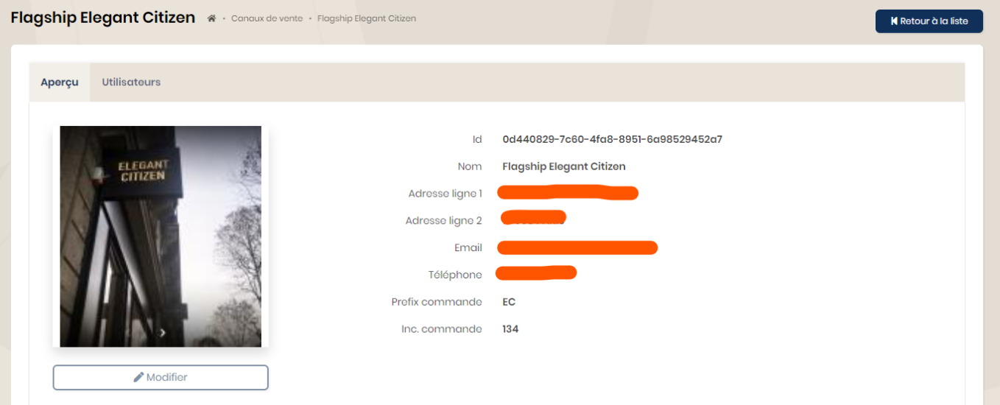

## Canaux de vente

Un canal de vente est un point physique (boutique) ou virtuel (site e-commerce). Tout utilisateur créé ne pourra accéder qu'aux informations (commandes, clients, ...) du canal de vente auquel il est lié.

Avant toute utilisation, il faut créer un ou plusieurs canaux de vente afin de pouvoir y lier les comptes utilisateurs.

A partir du menu "Canaux de vente", utiliser le bouton "+Nouveau canal de vente". Remplir le formulaire et valider. Une fois créé, celui-ci s'affiche dans la liste. En cliquant, vous obtenez le détail.

