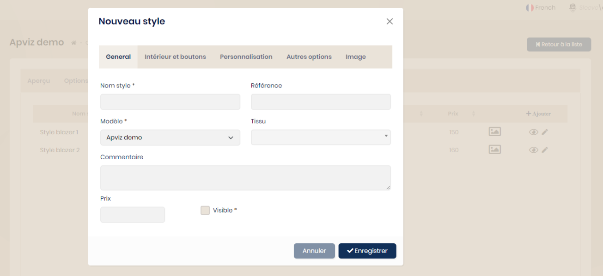

## Styles

Les styles sont créés à partir de l'onglet dédié du modèle choisi depuis le bouton 'Ajouter'.

Lors de la saisie, il faut renseigner chaque option et matière nécessaire lors de la demande de production. Une image peut être ajoutée.

