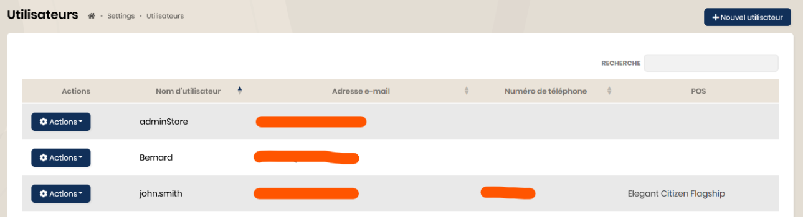

## Utilisateurs

### Les comptes et rôles

Trois types de compte ou `rôles` sont disponibles :
 - adminStore : compte administrateur réservé au BackOffice
 - store : compte utilisateur lié à un canal de vente
 - factory : compte dédié à la vue production
 
 Un compte adminStore est fourni lors de la création du tenant avec le TenantId. Ce compte a pour rôle 'adminStore'.

Pour créer un compte utilisateur, il faut se rendre dans le menu "Paramètres" puis "Utilisateurs.

