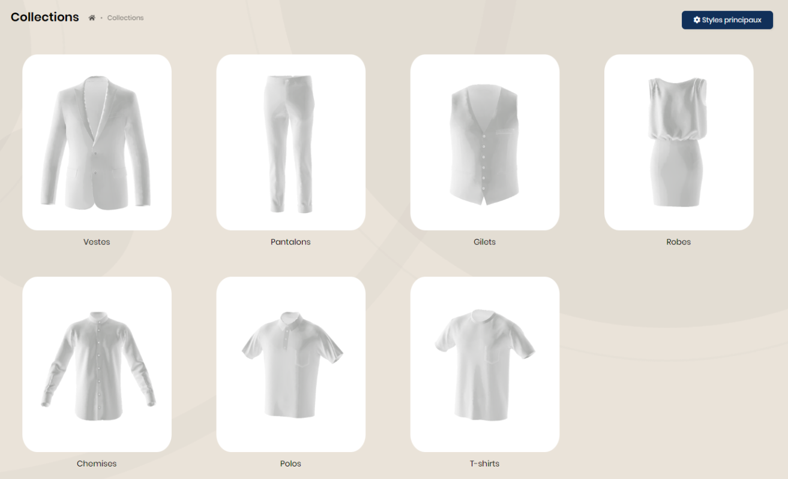
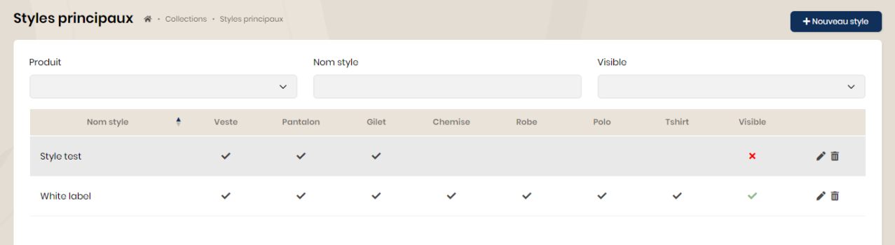
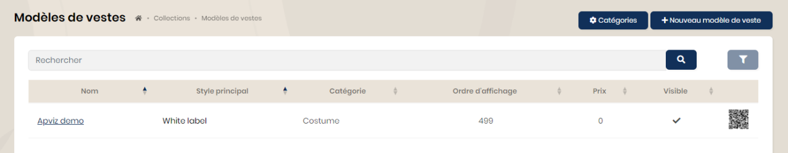
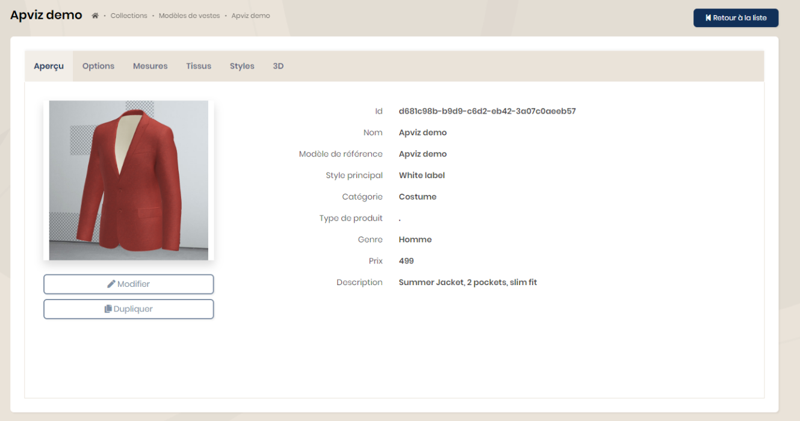

## Collections

Les collections détaillent toutes les caractéristiques des produits disponibles sur la plateforme, classés par type.

### Les styles principaux

Il est possible de définir des "styles principaux" regroupant un ou plusieurs types de produits.

Dans l'exemple ci-dessous, le style principal 'White label' pourra intégrer tous les types de produit. Lors de la saisie des modèles, vous pourrez définir le style principal correspondant.

### Les produits

Toutes les informations abordées ci-dessous seront identiques pour chaque type de produit (veste, pantalon, chemise, ...).

Lors du choix des vestes, la liste des modèles s'affiche.

#### Les catégories

Depuis cette page, il est possible de définir des catégories de veste (veste de costume, veste en cuir, blouson, ...). Cela permettra d'appliquer des filtres lors de l'affichage des listes de produits.

#### Les modèles

Lors du choix du modèle, vous accédez à toutes ses informations (aperçu, options, mesures, styles, tissus et 3D).

