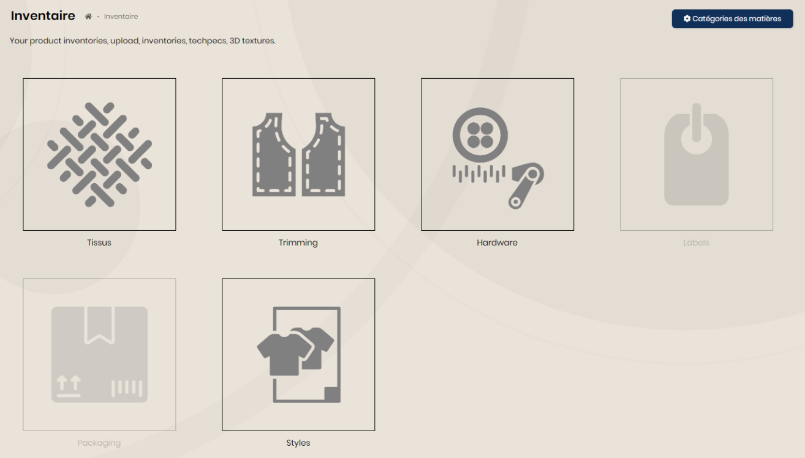
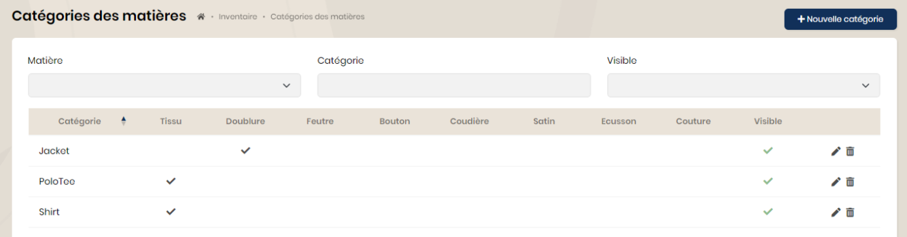
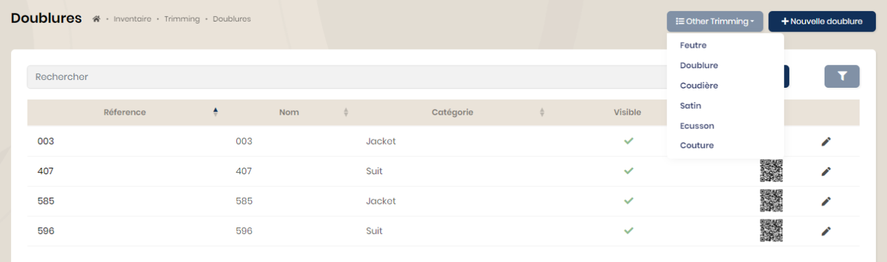
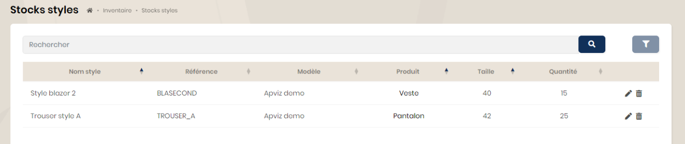

## Inventaire

Sont ajoutées en fin de page les vignettes permettant d'accéder aux applications clientes disponibles.

### Catégories des matières

Il est possible de définir des "catégories de matières" regroupant un ou plusieurs types de matières.

Dans l'exemple ci-dessous, la catégorie 'Shirt' pourra intégrer les tissus. Lors de la saisie des tissus, vous pourrez définir la catégorie correspondante.

### Matières

Les 3 vignettes 'tissus, trimming et hardware' permettent d'accéder aux listes des matières et leurs informations.

### Styles

La vignette 'Styles' permet d'accéder au stock des styles pré-définis dans les modèles.

