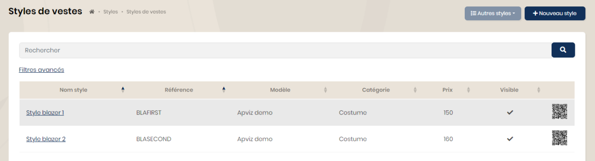
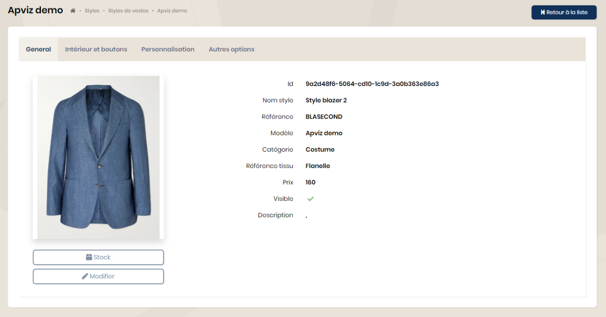

## Styles

Les styles sont des modèles pré-configurés (otions, mesures, tissus). Ils sont destinés à être commandés pour du prêt à porter. Ils sont disponibles pour tous les types de produit.

En choisissant un style, vous accédez sur la fiche qui détaille les otions et matières pré-configurées. Les mesures sont celles du modèle de base.

